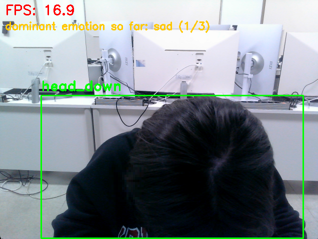
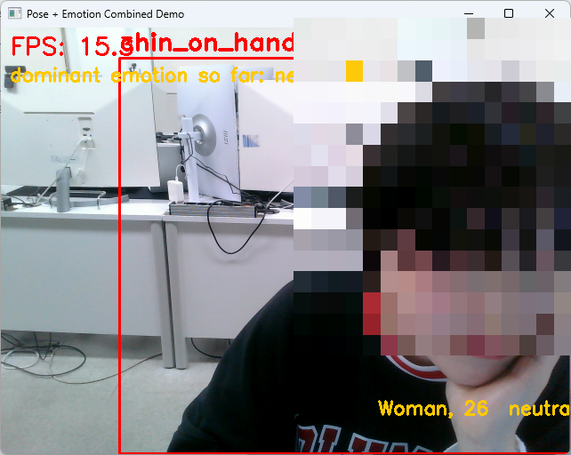
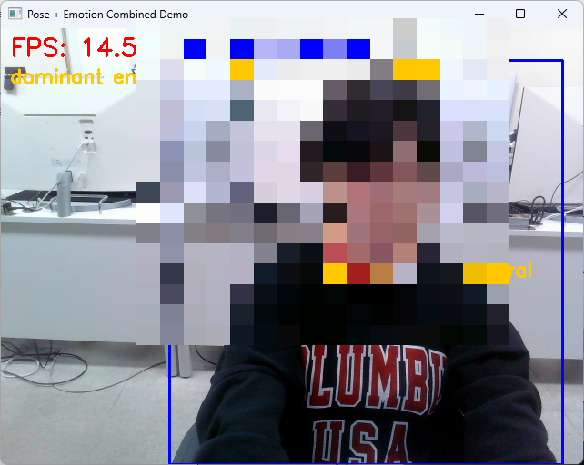

# DeskPoseAI — 책상 앞 집중 자세 + 표정 인식

웹캠 하나로 **"지금 집중하고 있는가"** 를 두 방향에서 읽어낸다 — 자세(포즈)로 한 번, 표정(감정)으로 한 번.
둘 다 사전 학습된 모델(YOLO-Pose, DeepFace)을 그대로 쓰되, 나온 결과를 표시만 하지 않고
분류·집계까지 이어지게 만든 AI 융합 프로젝트 실습(강의: Vision AI 실습)의 결과물이다.

## 왜 이 주제인가

수업 슬라이드가 추천한 주제 중 "강의실 집중 자세 모니터"를 기반으로 삼았다.
전신이 필요 없고(웹캠이 책상 위에 있는 실제 환경과 맞음), 자세 3종 + 표정만으로도
"지금 집중하고 있는지"를 판단할 수 있는 근거가 충분히 나온다는 점에서 실용적인 주제라고 판단했다.

| 폴더 | 실습 | 핵심 |
|---|---|---|
| [`실습3_Pose/`](./실습3_Pose) | 2D Pose Estimation 기반 행동 인식 | YOLO-Pose로 키포인트 추출 → XGBoost로 자세 3종 분류 |
| [`실습4_Emotion/`](./실습4_Emotion) | DeepFace 나이·성별·감정 인식 | 실시간 나이/성별/감정 추출 + 감정 집계 + 검출 백엔드 비교 |
| [`실습3+4_Combined/`](./실습3+4_Combined) | 통합 데모 (보너스) | 자세 라벨 + 나이/성별/감정을 한 화면에 동시 표시 |

---

## 실습3_Pose — 자세 인식

### 무엇을 하는가

책상 앞에 앉은 상태(전신 불필요)에서 3가지 집중 자세를 실시간으로 분류한다.

| 자세 | 뜻 | 의미 |
|---|---|---|
| `facing_forward` | 정면 보기 | 집중 상태 |
| `head_down` | 고개 숙이기 | 졸음 또는 딴짓 |
| `chin_on_hand` | 턱 괴기 | 나른함/피로 |

### 파이프라인

```
웹캠 프레임
   │
   ▼
YOLO-Pose (yolo26n-pose.pt)  →  사람 박스 + 17개 키포인트(x,y) 추출
   │
   ▼
박스 기준 정규화                →  x' = (px - box_x1)/box_width, y' 도 동일
   │                              (카메라 거리·프레이밍과 무관하게 값이 일정해짐)
   ▼
[학습 시] 좌표 증강              →  좌우 반전 + 위치/크기 지터 + 노이즈로 샘플 수 확보
   │
   ▼
XGBoost 분류기                  →  자세 3종 중 하나로 분류
   │
   ▼
웹캠 화면에 박스 + 라벨 표시
```

### 실행 순서 (5단계)

1. `12.2D_Pose_Estimation_test.py` — 모델/카메라 확인용 스모크 테스트
2. `13.2D_Pose_Save.py <자세이름>` — 자세별로 웹캠에서 키포인트+크롭 이미지 수집 (자세마다 실행)
3. `14.2D_Pose_Dataset_Save.py` → `14b_augment_keypoints.py` — 라벨 붙이고 좌표 증강
4. `15.2D_Pose_Training.py` — XGBoost 학습
5. `16.2D_Pose_ActionRecognition.py` — 웹캠 실시간 데모

### 핵심 발견 — 정규화 기준이 정확도를 좌우함

처음엔 키포인트를 **화면 전체 기준**으로 정규화했더니, 사람이 사진/웹캠 속 어디에 얼마나 크게
나오는지에 따라 값이 달라져서 모델이 "자세"가 아니라 "화면 속 위치"를 학습해버렸다.
그 결과 train loss는 0에 가까운데 val loss는 1.08로 벌어지는 전형적인 과적합이 발생했고,
검증 정확도는 **58.8%** 에 그쳤다.

**사람 박스 기준으로 정규화**(`x' = (px - box_x1) / box_width`)로 바꾸자 카메라 거리·프레이밍과
무관하게 값이 일정해졌고, 검증 정확도가 **97.8%** 까지 올라갔다. 이 전후 비교가 슬라이드가 요구한
"파생 특징 추가 후 성능 변화 확인"의 근거다.

자세한 실행 방법·요건 체크는 [실습3_Pose/README.md](./실습3_Pose/README.md) 참고.

---

## 실습4_Emotion — 나이·성별·감정 인식

### 무엇을 하는가

DeepFace(`age`, `gender`, `emotion` 세 가지를 한 번의 `analyze()` 호출로 추출)로 얼굴을 분석해
실시간으로 화면에 표시하고, 결과를 단순 표시에서 끝내지 않고 **집계·판단**까지 이어지게 만들었다.

### 원본 대비 채운 것

기본 소스코드(`Emotion_Detection.py` 원본)는 얼굴에 나이·성별·감정을 표시만 하고 끝났다.
슬라이드 필수 요건 중 2개가 비어 있었고, 이를 채웠다:

| 요건 | 구현 |
|---|---|
| 감정 결과를 판단·집계에 활용 | `collections.Counter`로 감정 등장 횟수 누적 → 화면에 "지금까지 우세 감정" 표시, 종료 시 콘솔에 비율 요약, `results/emotion_log_<backend>.csv`로 저장 |
| 검출 백엔드 2개 이상 비교 | `--backend opencv/mtcnn/retinaface/...` 인자화, `compare_backends.py`로 여러 실행의 로그를 모아 검출 수·감정 분포·평균 추정 나이 비교 |
| 웹캠 성능 문제 해결 | DeepFace 분석을 메인 루프에서 돌리면 분석하는 동안 화면이 멈춤 → 별도 스레드로 분리해서 항상 최신 프레임을 부드럽게 표시하고, 분석 결과만 비동기로 따라오게 구조 변경 |

### 백엔드별 특성 (슬라이드 8 기준)

| 백엔드 | 속도 | 정확도 | 비고 |
|---|---|---|---|
| `opencv` | 가장 빠름 | 정면은 무난, 측면은 약함 | 설치 불필요, 기본값 |
| `mtcnn` | 느린 편 | 정면·측면 모두 높음 | 랜드마크 포함 |
| `retinaface` | 보통~느림 | 작은 얼굴까지 가장 정확 | GPU 권장 |

### 보너스

`01_AgeGender/Age_Gender_Recognition.py` — DeepFace가 아닌 별도 WideResNet(IMDB-WIKI 가중치)
모델로 나이·성별만 따로 뽑아보는 비교용 스크립트. 필수 요건과는 무관한 참고용.

자세한 실행 방법·요건 체크는 [실습4_Emotion/README.md](./실습4_Emotion/README.md) 참고.

---

## 실습3+4_Combined — 통합 데모 (보너스)

두 실습을 한 화면에 합쳐서 **자세 라벨 + 나이/성별/감정을 동시에** 보여주는 최종 데모.
자세 인식은 매 프레임(가벼움), 감정 분석은 별도 스레드(무거움)로 돌려서 화면이 끊기지 않는다.

| head_down | chin_on_hand | facing_forward |
|---|---|---|
|  |  |  |

*(얼굴 부분은 공개 저장소 업로드를 위해 모자이크 처리함)*

박스 위쪽엔 자세 라벨, 아래쪽엔 `성별, 나이  감정`이 뜨고, 화면 상단엔 FPS와 지금까지 우세 감정이 표시된다.
자세한 실행 방법은 [실습3+4_Combined/README.md](./실습3+4_Combined/README.md) 참고.

---

## 폴더 구조

```
DeskPoseAI/
├── README.md
├── 실습3_Pose/
│   ├── 00_Models/                     # yolo26n-pose.pt (gitignore, 최초 실행 시 자동 다운로드)
│   ├── README.md
│   └── 01_PoseAction/
│       ├── 12.2D_Pose_Estimation_test.py
│       ├── 13.2D_Pose_Save.py         # 자세별 웹캠 수집
│       ├── 13b_quick_collect.py       # 숫자키로 자세 전환하며 한 세션에 수집
│       ├── 13c_collect_from_images.py # 이미지 폴더에서 일괄 수집
│       ├── 14.2D_Pose_Dataset_Save.py
│       ├── 14b_augment_keypoints.py   # 좌표 증강
│       ├── 15.2D_Pose_Training.py     # XGBoost 학습
│       ├── 16.2D_Pose_ActionRecognition.py
│       └── pose_img/person/           # classes.json, keypoints.csv, model_weights.xgb 등
├── 실습4_Emotion/
│   ├── README.md
│   ├── Emotion_Detection.py           # 메인: 나이/성별/감정 + 집계
│   ├── compare_backends.py            # 백엔드 비교
│   ├── 01_AgeGender/Age_Gender_Recognition.py  # 보너스
│   └── results/emotion_log_*.csv
└── 실습3+4_Combined/
    ├── README.md
    ├── combined_demo.py
    └── docs/demo_*.png
```

## 공통 설치

```bash
conda activate vision_new
pip install ultralytics opencv-contrib-python pandas xgboost scikit-learn numpy deepface
```

## 저장소에서 제외한 것 (.gitignore)

- 모델 가중치(`*.pt`, `*.hdf5`, `00_Models/`) — 실행 시 자동/1회 다운로드로 받는 것들이라 용량만 차지함
- 얼굴이 찍힌 개인 웹캠 사진(`pose_img/person/facing_forward|head_down|chin_on_hand/`, `raw_images/`) — 공개 저장소라 얼굴 원본은 올리지 않고 코드/파생 데이터(csv)만 공개
- 강의자료 `*.pptx`, `*.zip`

## 원본 대비 바뀐 점 요약

두 실습 모두 원본 슬라이드 기본 소스코드(웹캠에 결과만 표시)로 시작했고, 아래를 채워서
슬라이드가 요구하는 필수 요건(직접 수집, 커스텀 클래스 3개 이상, 판단/집계 활용, 조건 비교, 실시간 데모)을 충족시켰다.

- 포즈 모델을 `yolov8n-pose.pt` → `yolo26n-pose.pt` 로 교체 (강사 안내)
- 포즈: 키포인트 정규화 방식을 화면 전체 기준 → 사람 박스 기준으로 수정 (정확도 58.8% → 97.8%)
- 포즈: 좌표 증강 스크립트(`14b_augment_keypoints.py`) 추가로 소량의 실촬영 데이터를 학습 가능한 규모로 확장
- 감정: 감정 결과를 집계·판단에 활용하도록 추가, 백엔드 비교 스크립트 추가
- 감정: DeepFace 분석을 별도 스레드로 분리해 웹캠 프레임 드랍(끊김) 해결
- 보너스: 두 실습을 하나의 웹캠 화면에서 동시에 보여주는 통합 데모 추가

## 한계 / 다음 단계

- 표정 백엔드는 조명·각도에 민감함 — retinaface가 가장 안정적이지만 GPU 없이는 느림
- 성별 판정은 헤어스타일 등 외형에 크게 좌우되어 프레임마다 흔들릴 수 있음 — 최근 N회 다수결로 안정화하면 개선 가능
- 자세 학습 데이터가 본인 1인 기준이라 다른 사람에게는 일반화가 덜 될 수 있음 — 여러 사람 데이터로 재학습하면 보완 가능
- 프레임 간 정보(시간 변화량)를 안 써서 "서는 중" 같은 전이 동작은 구분하지 못함 — LSTM/1D CNN으로 시퀀스 분류 확장 가능
